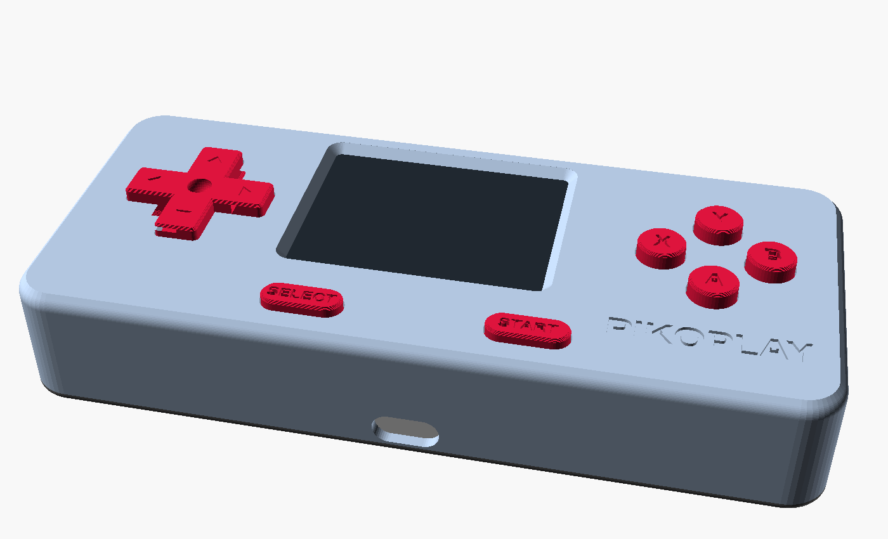

# PikoPlay

A small open-source handheld game console built on the RP2040. This repo has the firmware and a
3D-printable case. The PCB design files will be added later.



What it plays:

* Built-in games: Pong (1 or 2 players), Snake, Flappy, Breakout
* NEKO, a little cat you look after
* Game Boy, Game Boy Color, NES and Atari 2600 games (homebrew, or dumps of carts you own)

It can also act as a USB gamepad for a PC. There is no sound (no speaker on the board).

## Hardware

* GD007-Glyph-RP2040 module (RP2040, 8 MB flash, USB-C), running at 250 MHz
* 2.0" ILI9225 SPI screen, 176x220, used sideways as 220x176
* 10x 6 x 6 mm tactile switches (5 mm plunger): D-pad, A B X Y, START, SELECT
* LiPo battery 34 x 50 x 7 mm with a 2-pin JST plug, and a small power switch
* Buttons connect their GPIO to GND (internal pull-ups, no resistors). The screen uses SPI0.

| Pin | GPIO | | Button | GPIO |
|---|---|---|---|---|
| SCK / MOSI | 2 / 3 | | UP / DOWN | 7 / 8 |
| LCD CS / DC / RST | 4 / 5 / 6 | | LEFT / RIGHT | 12 / 13 |
| SD CS / MISO | 1 / 0 | | A / B | 25 / 26 |
| | | | X / Y | 24 / 23 |
| | | | START / SELECT | 21 / 20 |

## Install the firmware

Install [PlatformIO](https://platformio.org/), plug the console in over USB and run:

```sh
pio run -t upload
```

## Use it

* LEFT/RIGHT picks a system, A opens it, B goes back. Only A starts things.
* Hold SELECT+START for one second to leave a game. Saves are written then.
* SETTINGS has the theme, screen size, menu speed and more.

## Add games

Games are copied over USB while the console is on, with `pikolink`. It works on Linux, macOS and
Windows and finds the console by itself. Build it with any C++ compiler:
`c++ -std=c++17 -O2 -Isrc tools/pikolink.cpp -o pikolink` (or `make -C tools`).

```sh
pikolink put game.gb  /roms/gb/game.gb
pikolink put game.gbc /roms/gbc/game.gbc
pikolink put game.nes /roms/nes/game.nes
pikolink put game.a26 /roms/atari/game.a26
pikolink ls /roms/gb
pikolink rm /roms/gb/game.gb
pikolink get /saves/gbc/game.sav backup.sav   # back up a save
```

Games go to a 7.25 MB area of flash that the firmware update does not touch, so they and your
saves survive firmware updates. PlatformIO's `uploadfs` would erase the saves, so use `pikolink`.
Only use ROMs you are allowed to: homebrew or dumps of your own cartridges.

## Make your own built-in game

Games are plain C++ in `src/native/`. Look at `arcade.cpp` (Pong, Snake, Flappy, Breakout): each
game reads the buttons once per frame, draws the screen and calls `presentDiff()`. Add yours to
`Arcade::Game` and it shows up in the ARCADE list.

## Print the case

Print everything from `case/stl/` (PLA or PETG, no supports): `shell`, `lid`, `dpad`, `startsel`,
and either `abxy` or the four `button_*` files to give each face button its own colour.

Screws and inserts:

* PCB to shell: 4x M2.5 x 5 screws into 4x M2.5 x 5 brass heat-set inserts
* Lid to shell: 4x M3 x 8 screws into 4x M3 x 5 brass heat-set inserts

Battery: a 34 x 50 x 7 mm LiPo.

To change the model, open `case/pikocase.scad` in OpenSCAD; all sizes are in `case/config.scad`.

## License

* Software: MIT ([LICENSE](LICENSE))
* Case: CERN-OHL-P-2.0 ([case/LICENSE](case/LICENSE))
* Game Boy core: Walnut-CGB (MIT), in `lib/walnut_cgb/`.
* NES core: InfoNES / pico-infones (GPL-3.0), in `lib/infones/` with its own
  [LICENSE](lib/infones/LICENSE). Because of it, a built firmware binary is covered by the GPL-3.0
  as a whole.
* Built with the Arduino-Pico core and TFT_eSPI (fetched by PlatformIO).

PikoPlay is a hobby project and is not connected to Nintendo or Atari. Game Boy and NES are
trademarks of Nintendo, Atari 2600 of Atari; the names only say which games it can run.
